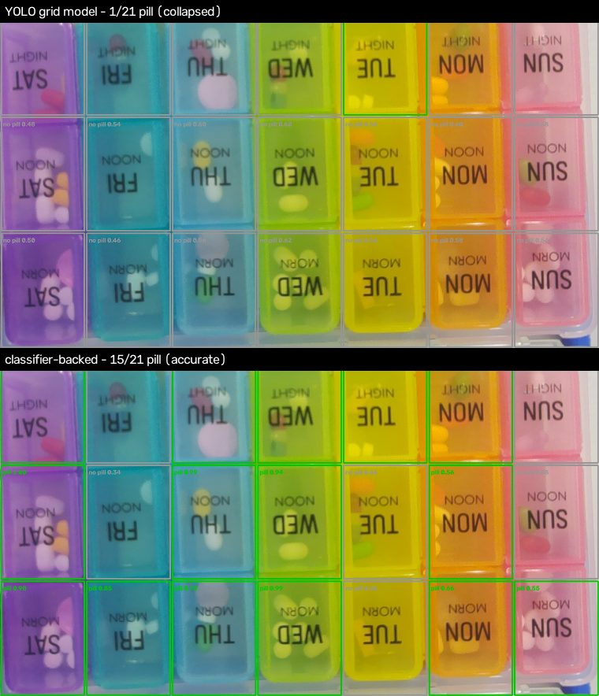
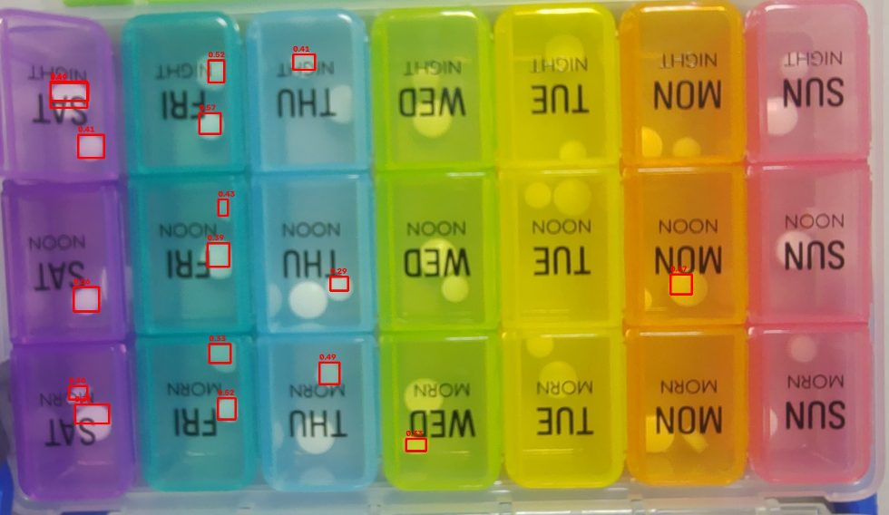

# YOLO pill detector (experiment)

A "for fun" alternative to the shipped classifier (`../`): instead of asking
per cell *is there a pill?*, this trains a real **YOLO object detector** that
draws a box around each pill it sees. It is **not** wired into the app and is
not needed on the Pi — the classifier remains the production path (see the
[detection README](../README.md) for why detection is the heavier tool for a
presence/absence question).

## Three datasets

- **`build_gridset.py` → `dataset/yolo_grid/`** — **grid classification**: each
  of the 21 compartments is a fixed full-cell box and YOLO just classifies it
  `pill` / `no_pill`. Clean framing, but the from-scratch YOLO model trains
  poorly (it collapses to `no_pill`) — see "Grid-classification" below for why,
  and use `detect.py --classifier` for an accurate version of the same visual.
- **`build_handset.py` → `dataset/yolo_hand/`** — a hand-labelled dataset with
  one box per occupied compartment (covering the pill cluster). See
  "Hand-labelled dataset".
- **`make_dataset.py` → `dataset/yolo/`** — the original, fully auto
  pseudo-labels (per individual pill). Inherits the blob detector's blind
  spots. See "How it works (auto pseudo-labels)".

## Grid-classification dataset (`build_gridset.py`)

Instead of localising pills, **every compartment is a fixed full-cell box and
the model only classifies it** `pill` vs `no_pill`. Because the box is always
the whole compartment there is nothing to localise, so:

- no hand-drawn boxes are needed — the label of each cell comes straight from
  the hand-reviewed `../labels.json`;
- it is immune to how the pills sit (one pill, a packed pile, or a pill the
  same colour as its lid all get the same full-cell box);
- output is exactly what a pillbox monitor wants: a 7×3 grid of pill / no-pill.

Two classes (`0: no_pill`, `1: pill`); every image has all 21 boxes.

```bash
pip install ultralytics
python3 detect/crop_cells.py
python3 detect/yolo/build_gridset.py       # -> dataset/yolo_grid/
python3 detect/yolo/train.py --data dataset/yolo_grid/pillbox.yaml \
    --project dataset/yolo_grid/runs
# accurate version of the same box-per-cell visual (recommended):
python3 detect/yolo/detect.py images/photo_20260713_152018.jpg --classifier --out demo.jpg
# the trained YOLO grid model (collapses — see below):
python3 detect/yolo/detect.py images/photo_20260713_152018.jpg \
    --weights dataset/yolo_grid/runs/pill/weights/best.pt --out demo_yolo.jpg
```

### Why the YOLO grid model fails — and what to use instead

The framing is clean, but a from-scratch YOLO trained on the raw RGB grids
**collapses to predicting `no_pill` almost everywhere**: on the held-out set
it scores ~41% per-compartment accuracy, which is essentially the
"always guess no_pill" majority baseline. On a box that is 21/21 full of
pills it labels one compartment `pill`.

The reason is the whole point of this repo: **telling a pill from an empty
compartment through a coloured translucent lid needs the empty-box
reference to compare against.** The shipped classifier gets this right (~88%)
because it is fed six channels — the compartment *and* the same compartment of
the empty reference. A plain RGB YOLO has no reference, so through a tinted
lid it can't distinguish pill from empty and falls back to the majority class.
(From-scratch init with no COCO warm-start — GitHub blocked in the sandbox —
and only ~35 training images don't help either.)

So `detect.py --classifier` renders the exact same box-per-cell pill/no-pill
grid, but takes each verdict from the accurate classifier (`../pipeline.py`)
instead of the collapsed YOLO. Top row below is the YOLO grid model on a
packed box (1/21 pill — wrong); bottom row is `--classifier` (15/21 — right):



`detect.py` auto-detects the model kind from its class names, so it also draws
the single-class detectors below (pill boxes only).

## Hand-labelled dataset (`build_handset.py`)

Labelling philosophy: **one box per occupied compartment**, covering the pill
cluster — *not* one box per individual pill. That matches the goal (detect
whether a compartment holds a pill, not count them), stays complete when a
compartment is packed with overlapping pills, and is what can be labelled
reliably by eye.

Each box is built like this, for every compartment `../labels.json` marks
`pill`:

- compare the compartment to the same compartment of the empty-box reference
  photo and take the bounding box of the **changed region** (printed day/slot
  text masked out) — small for one pill, large for a packed compartment;
- compartments where the pill is the **same colour as its lid** change almost
  nothing, so those use **hand-drawn boxes** I placed by eye at high zoom,
  frozen in `camo_boxes.json` (36 boxes across 15 compartments).

The pill/empty status of every compartment comes from the hand-reviewed
`../labels.json`, so no occupied compartment is missed and no empty one is
boxed. `handset_labels.json` holds every resulting box for inspection.

```bash
pip install ultralytics
python3 detect/crop_cells.py               # cell crops (also builds the reference)
python3 detect/yolo/build_handset.py       # -> dataset/yolo_hand/  (418 boxes, 46 imgs)
python3 detect/yolo/train.py --data dataset/yolo_hand/pillbox.yaml \
    --project dataset/yolo_hand/runs
python3 detect/yolo/detect.py images/photo_20260713_145101.jpg \
    --weights dataset/yolo_hand/runs/pill/weights/best.pt --out demo.jpg
```

Honest limits: boxes were placed by visual review, not a pixel-drag tool, so
they're compartment-accurate rather than pixel-perfect; a box occasionally
includes a sliver of printed text where a pill sits on it. The truly
same-colour-as-lid pills are faint even at high zoom, so those ~15 hand boxes
are best-effort.

## How it works (auto pseudo-labels)

Detectors need bounding-box labels, which this dataset never had. So the
boxes are **generated, not hand-drawn**:

1. `make_dataset.py` warps each photo to the canonical top-down 7×3 grid
   (reusing `../crop_cells.py`) and, inside every cell that `../labels.json`
   marks `pill`, runs the classifier's DoG blob detector to find the pill
   blob(s) and writes YOLO boxes for them. Empty cells get no boxes.
   Training on the **warped grid** (not the raw photo) keeps the loose pills
   scattered across the table — which were never labelled — out of frame, so
   they can't act as unlabelled positives.
2. `train.py` fine-tunes / trains `yolov8n` on the single `pill` class.
3. `detect.py` runs the trained model on a new photo (locate → warp → YOLO)
   and reports which of the 21 cells have a detected pill (presence by
   detection centre — not a count).

```bash
pip install ultralytics
python3 detect/crop_cells.py            # need the cell crops first
python3 detect/yolo/make_dataset.py     # -> dataset/yolo/ (~1200 pseudo boxes)
python3 detect/yolo/train.py            # -> dataset/yolo/runs/pill/weights/best.pt
python3 detect/yolo/detect.py images/photo_20260713_145101.jpg --out demo.jpg
```

## Results

Trained from scratch (no COCO warm-start — see below), 200 epochs on CPU:

| metric | value |
|---|---|
| precision | 0.46 |
| recall | 0.21 |
| mAP@0.5 | 0.18 |
| mAP@0.5:0.95 | 0.06 |

Low by benchmark standards but it does what it says — here it is on a
**held-out** photo (`images/photo_20260713_145101.jpg`, a scene the model
never trained on), boxing the white pills through the purple/teal/blue lids:



The recall of ~0.2 is visible too: pills in the yellow/green (WED/TUE) lids
are mostly missed — same-colour-as-lid pills make no blob, so the
pseudo-labeller never boxed them and the detector never learned them.

## Caveats (it's a toy)

- **Pseudo-labels inherit the baseline's blind spots**: a pill the same
  colour as its lid produces no blob, so it's unlabelled and the detector
  never learns to see it — the exact case the 6-channel classifier was built
  to fix.
- **Trained from scratch.** The COCO-pretrained `yolov8n.pt` is downloaded
  from GitHub, which was blocked in the build sandbox, so `train.py` defaults
  to `yolov8n.yaml` (random init). With only ~35 training grids that limits
  accuracy; pass `--weights yolov8n.pt` for a warm start if you have the file.
- **Only ~18 distinct capture scenes** back the whole thing, split by scene
  into train/val — so treat the metrics as a demo, not a benchmark.

For real per-cell status, use the classifier and the app's `/status` page.
This folder is here because a YOLO version is a fun thing to see draw boxes.
